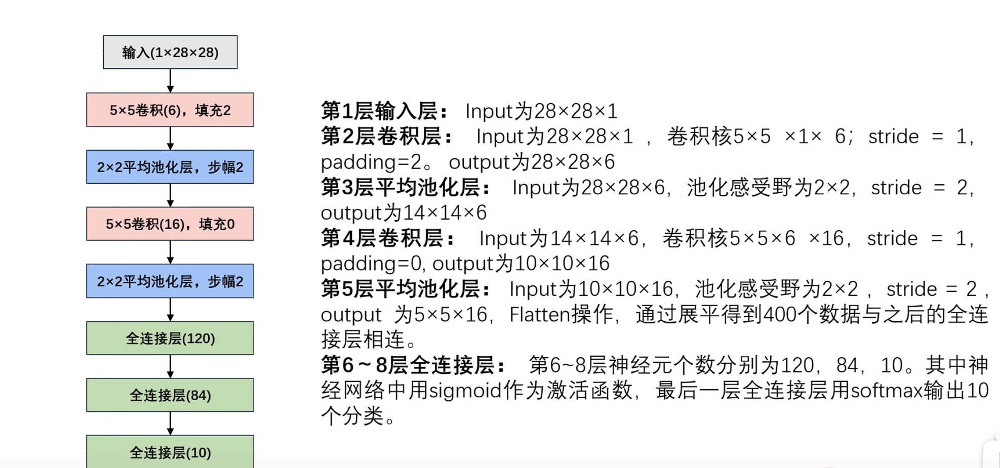
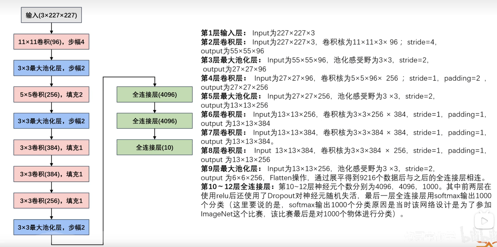
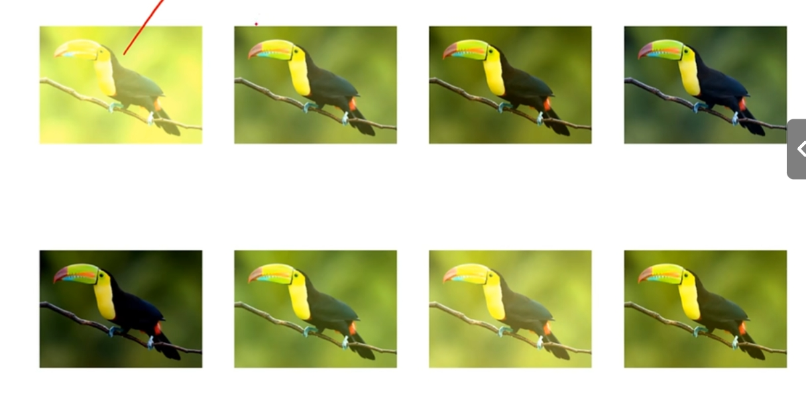

# 输入输出公式
$$
OH=
$$****
# LeNet(**FIRST CNN**)
lenet5代表 这个网络有5层（3层卷积层、2层全连接 这五层指的是具有参数的计算，池化运算不算，全连接层是的）
### 特征提取部分
提取出目标中的
### 目标检测部分
分类＋回归  由三个全连接层组成

## 数据传输
batch size 输入批次数
model→w、b
==卷积层输入的数据往往是4维的（B、C、W、H）==
B代表批次 C代表通道数 W、H分别代表宽和高
==卷积核（B、C、FW、FH）==
FW、FH代表卷积核
==卷积层的输出的也为4维（B、FN、OW、OH）==
FN为卷积核的个数 OW、OH为输出的高宽

==全连接层输入（B、L）==
L=FN×OH×OW
==全连接层输出（B、FL）==
FL人为确定的
## 网络参数详解
attention
卷积→通道变大
池化→特征图变小
展平操作 之后再进行
400→120
120→84 
84→10

## 总结
1. 组合使用非线性激活函数sigmoid函数、全连接层：卷→sig→池
2. 特征提取网络＋输出结果
3. 为了构造高性能的卷积神经网络，通常对卷积层进行排列逐渐==降低其表示的空间分辨率，同时增加通道数==

# AlexNet
## 背景
相对LeNet：lenet难以获取适配的硬件且可解释性差，无法超越机器学习（机器学习具有完善的理论基础）大规模数据处理不如机器学习
李飞飞→alexnet ==2012== ILSVRC冠军 机器超过人类
吴恩达 何凯文
==ResNet== 何凯明 2016
## 网络结构
AlexNet和LeNet的设计理念非常相似,但也存在显著差异
首先，AlexNet比相对较小的LeNet5要==深得多==。
其次，AlexNet由八层组成:==五个卷积层、两个全连接隐藏层和一个全连接输出层==。
最后，AlexNet==使用ReLU==而不是sigmoid作为其激活函数。
（relu和sig对比图）神经元死亡？
## 网络参数详解
卷积核对应下一层的通道数
Relu→最大池化→卷积
卷积→Relu→卷积
这里存在一个卷积使得通道数变小的原因：防止全连接层过拟合
6×6×256→展平→全连接(4096) 导致w==很大== w=6×6×256×4096
测试的时候效果好，但实际应用时效果差，因为网络参数过多 
Dropout失活一部分神经元 #过拟合

## Dropout
### 正常流程
x→全连接层×n→输出（对应label）→计算loss函数→反向更新w
### Dropout流程
dropout=0.2 随机抽0.2数据失活导致此轮训练不更新
很多轮 但不是每一轮都更新 从而达到加速以及防止过拟合效果
数据难找且耗时 项目任务的主体部分→**扩增、随即裁剪、PCA（主成分分析）**
## 数据增强
### 扩增
扩增的目的：
1. 扩充数据集
2. 防止过拟合 #过拟合
### 随机裁剪
## PCA
**PCA图像增强流程**:
1. 将图片按照RGB三通道进行normalization（归一化）处理，均值为0，方差为1,
2. 将图片按照channel展平成大小为(HW,3)的矩阵。
3. 计算展平后的矩阵的协方差矩阵，协方差矩阵的大小为(3,3)
4. 对协方差矩阵进行特征分解，得到对应的特征向量(3,3)和特征值(3,1)
5. 设置一个==抖动系数==（人为设置），该抖动系数是一个(3,1)大小的矩阵，里面的元素是随机值，利用抖动系数和对应的特征进行相乘，依然得到一个(3.1)大小的矩阵，对该矩阵进行转置并和特征向量进行矩阵相乘，得到一个(3,1)大小的矩阵;
6. 利用上述最后计算出来的(3,1)大小的矩阵，其中的==3个值分别加到原图像的R,G,B三通道上==，就是最后得到的增强的图像。
（一个固定值加入到所有的例如R的所有数字上）
## 局部归一化LRN
### 局部归一化作用:
对局部的值进行归一化操作，使其中比较大的值变得相对更大，==增强了局部的对比度==，在AlexNet中有==1.2个百分比==左右的提升。（**效果一般**）
### 局部归一化流程:
1、手动设置的超参(k防止分母为0，α，β，n范围数)
2、对每个值利用公式计算局部归一化后的值。
## 总结
1. AlexNet和LeN&t设计上有一脉相承之处，也有区别。为了适应lmageNet中大尺寸图像，其使用了==大尺寸的卷积核==，从11x11到5x5到3x3，AlexNet的卷积层和全连接层也带来更多的参数6000万，这一全新设计的CNN结构在图像分类领域取大幅超越传统机器学习，自此之后CNN在图像分类领域被广泛应用。
2. 使用了**Relu**替换了传统的sigmoid或tanh作为激活函数，大大==加快了收敛==，减少了模型训练耗
3. 使用了Dropout，提高了模型的准确度，减少过拟合，这一方式再后来也被广泛采用
4. 在CNN中使用重叠的==最大池化==。此前CNN中普遍使用平均池化AlexNet全部使用最大池化，避免平均池化的模糊化效果。并且AlexNet中提出让步长比池化核的尺寸小，这样池化层的输出之间会有重叠和覆盖，提升了特征的丰富性。
5. 使用数据了2种数据扩增技术，大幅增加了训练数据，增加模型鲁棒性，减少过拟合。
6. 使用了LRN正则化、多GPU并行训练的模式(不过之后并没有被广泛应用)